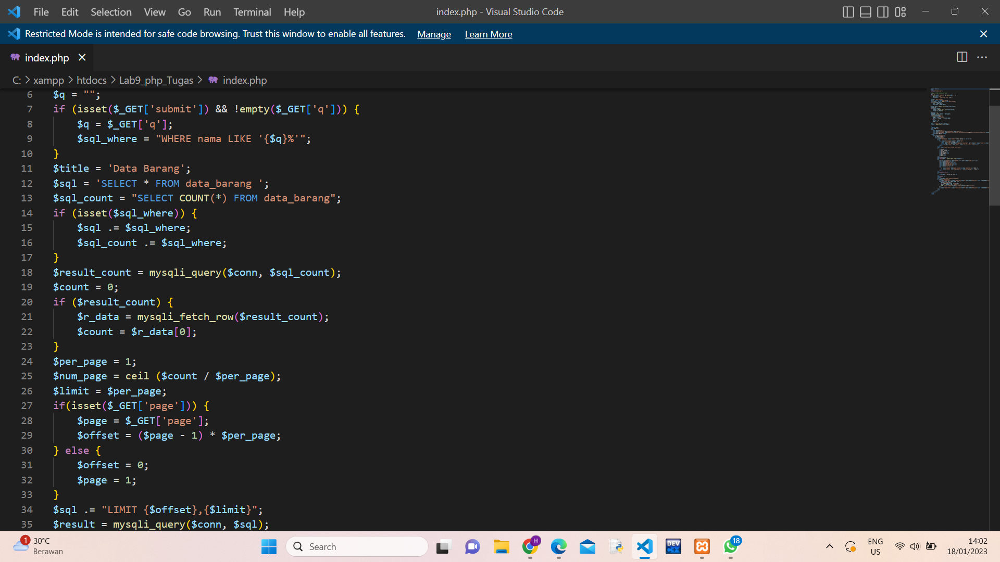
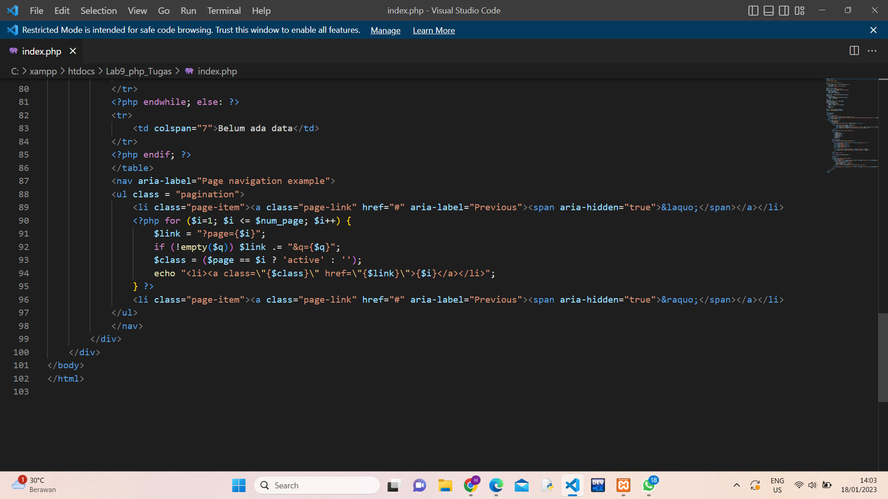
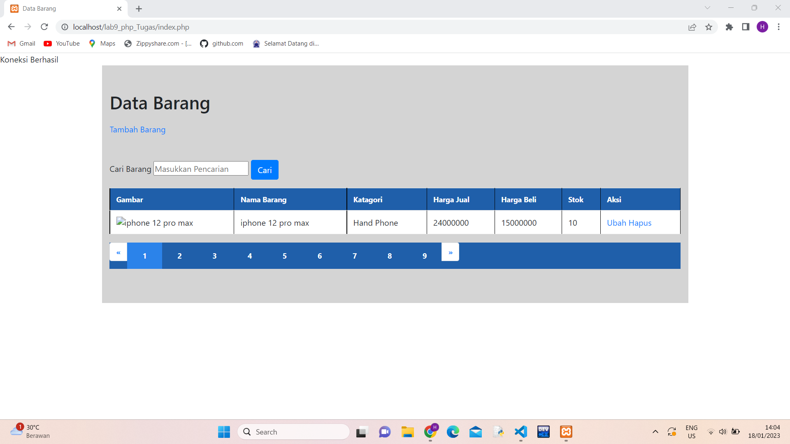

# Lab13web

| NAMA  :| HIDAYAT TULLOH |
| ----- | -----  |
| NIM   :| 312110110 |
| KELAS :| TI.21.B1 |
| DOSEN :| Agung Nugroho,S.Kom.,M.Kom |

| Pagination digunakan untuk membatasi atau membagi record data yang akan ditampilkan pada laman web. Dari seluruh record data yang ada akan dibagi berdasarkan jumlah record perhalaman.Pada prinsipnya untuk membatasi tampilan record data pada query mysql menggunakan LIMIT dan OFFSET; |
| --------- |

 

| Merubah File index.php |
| --- |

 
 

 

 

| Tampilan DI http://localhost/lab9_php_Tugas/index.php |
| --- |

 